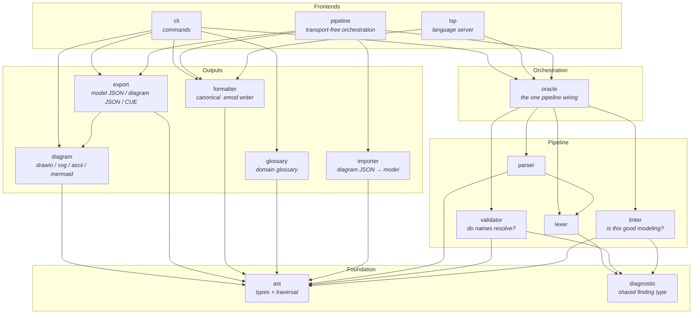
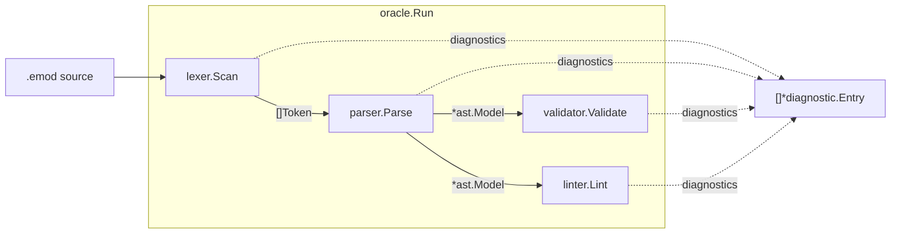
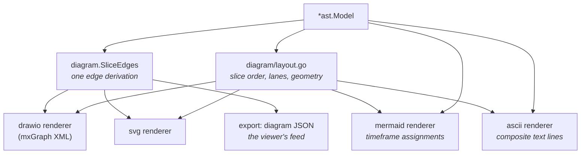
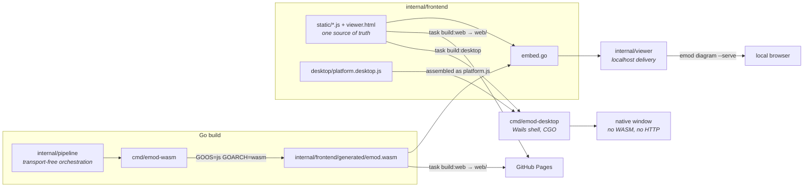
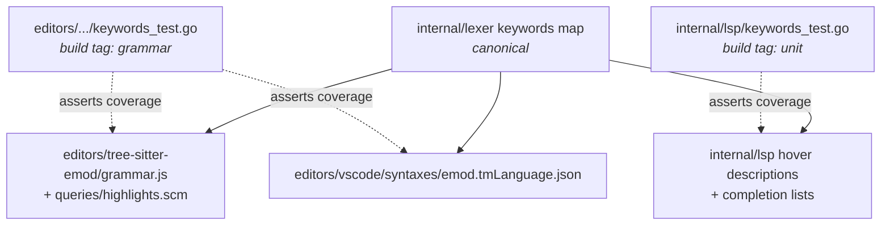

# Architecture

emod is a DSL for event modeling. You write `.emod` files describing commands,
events, views, automations and translations; the tool validates them against
event-modeling anti-patterns and renders them as diagrams. One Go module holds
the language pipeline, every frontend that drives it, and the assets of a
browser viewer; the editor grammars live beside it under `editors/`.

## Repository map

| Path | What it is |
|---|---|
| `cmd/emod` | CLI entry point (thin; all logic in `internal/cli`) |
| `cmd/emod-wasm` | WebAssembly entry point exposing the pipeline to the browser viewer |
| `cmd/emod-desktop` | Native desktop shell (Wails); the one binary that links CGO |
| `internal/` | The language pipeline, frontends and renderers (see below) |
| `editors/tree-sitter-emod` | tree-sitter grammar + corpus/highlight tests |
| `editors/vscode` | VS Code extension: TextMate grammar, language config, LSP client |
| `examples/` | Showcase models (`*_test.emod` files are deliberately broken fixtures) |
| `e2e/` | Docker-based CLI end-to-end tests (vitest + node-pty) |
| `e2e-viewer/` | Playwright end-to-end tests against the built viewer bundle |
| `docs/` | Reference and architecture documentation |
| `web/`, `bin/`, `dist/` | Build outputs, gitignored — never edit these |

## Package layout

Packages form a strict layering: pure data at the bottom, pipeline stages above
it, then renderers and serializers, then the frontends that wire a pipeline run
to an interface. Arrows read "depends on".

Not shown: `internal/frontend` (the viewer's JS modules and the embed
directive that reaches them, depending on nothing above), `internal/viewer`
(the localhost HTTP delivery the CLI uses to serve them), `internal/desktop`
(the pipeline entry points the desktop shell binds to its frontend, importing
no GUI framework so it stays testable), `internal/cue` (an embedded CUE schema
the `emod schema` command prints and the export tests vet against) and
`internal/test` (shared model fixtures used only by tests).

## The language pipeline

Every frontend runs the same chain through `internal/oracle` — it is the only
place the stages are wired together, so the CLI, the LSP and the browser
cannot disagree about what a file means.

- **`oracle.Parse`** runs the lex/parse prefix and returns a best-effort model:
  non-nil even when diagnostics are present, holding whatever the parser could
  recover. Formatting and read-only commands use it.
- **`oracle.Run`** runs the full chain. `emod validate` and `emod lint` both
  use it and report identical diagnostics; commands producing output
  (`diagram`, `export`) run it first and gate on error severity.
- **`validator` vs `linter`**: the validator answers *"do referenced names
  resolve?"* and only ever emits errors; the linter answers *"is this good
  event modeling?"* (naming smells, coupling smells, DCB mode rules) at info,
  warning or error severity, each finding carrying a rule name that
  `emod lint explain <rule>` describes.
- **`ast`** is the shared vocabulary: pure node types plus the traversal
  helpers `Model.SliceRefs`/`AllSlices` and `Context.SliceRefs`/`AllSlices`,
  which return slices in source order paired with the context and aggregate
  declaring them. A slice hangs off an aggregate *or* directly off a
  `mode dcb` context — always traverse through these helpers rather than
  walking `ctx.Slices` and `agg.Slices` by hand. The one exception is
  `arrange`, which reorders those fields: the helpers flatten the containers
  and sort by source position, which is precisely what reordering has to
  change.
- **`diagnostic.Entry`** is the one finding shape every stage emits, so
  frontends render CLI text, LSP diagnostics and viewer JSON from the same
  values.

## Diagram rendering and export

Which *arrows* a model contains is decided once, in `diagram.SliceEdges`: the
semantic edges of a slice (trigger→command, flows, subscriptions, automation
and translation wiring), including the rule that a translation's implied
command→event arrow is derived only when no flow already declares the same
pair. Renderers keep only their format's drawing concerns.

ASCII and mermaid read the AST directly by design: they don't draw arrow sets
(ASCII prints composite per-slice lines, mermaid assigns elements to
timeframes), so the edge IR has nothing to offer them. The cross-format
contract test in `internal/diagram/contract_test.go` asserts the behaviour all
renderers share.

`internal/export` holds three serializers in three files: `json.go` (a 1:1
model mirror for tooling), `diagram.go` (the `{model_name, nodes, edges}`
graph the web viewer consumes) and `cue.go` (schema-conformant CUE text).
`internal/importer` is the inverse of the diagram JSON — the viewer's edits
come back through it and are written out by `formatter`, so `.emod` text has
exactly one writer.

## Frontends

| Command | Does |
|---|---|
| `emod validate` / `emod lint` | Full pipeline; identical diagnostics, text or JSON output |
| `emod lint explain <rule>` | Describes any rule name the tool can print |
| `emod fmt` | Parse + `formatter.Format`; `--check` for CI |
| `emod diagram` | drawio / svg / ascii / mermaid; `--serve` starts the embedded viewer; `--specs` draws each slice's specs as a card, drawio and svg only |
| `emod export` | json / diagram-json / cue |
| `emod slices list` | Lists every slice with its detected pattern |
| `emod slices arrange` | Reorders view slices so references read forward; `--check` for CI |
| `emod glossary` | Domain glossary as markdown or JSON |
| `emod schema` | Prints the embedded CUE schema |
| `emod lsp` | Starts the language server on stdio |

The **LSP** (`internal/lsp`) layers transport framing → dispatch
(`server.go`) → one pure function per feature (`GetCompletions`,
`GetDefinition`, `GetReferences`, `GetHover`, `GetSemanticTokens`) taking
`(text, line, character)`. Diagnostics and formatting go through the oracle.
`keywords_test.go` pins that every lexer keyword has a hover description and
that completion lists never offer a spelling the lexer doesn't define.

## The viewer, and its three distributions

The viewer is a plain-ES-module app living under `internal/frontend/static/`
(that location is what `//go:embed` can reach). One copy of it serves three
distributions over two runtimes: the CLI serves it from localhost and the
published web bundle is the same files hosted statically — both reaching the
pipeline through WebAssembly, covered in depth by
`docs/wasm-architecture.md` — while the desktop app calls the pipeline
natively.

What differs between the runtimes is confined to one module. Every shared
module imports `./platform.js` for the things a host provides rather than the
UI: reaching the Go core, reading the files a drop handed the page, writing a
model out, naming the window, showing it as holding unsaved work, saying which
file it has adopted, asking what to do about that work before it would be lost,
delivering a file the host opened, delivering the files a host resolved a drop
to, asking the viewer to save, asking whether the window may close, and
answering what state the app opened with. `platform.browser.js` implements that
over WebAssembly, `fetch`, the browser's download and `document.title`, with
four of them inert: a page has no window of its own to mark, no list of what it
has opened, no dialog whose Save writes anywhere, and no close it can refuse
asynchronously. `platform.desktop.js` implements it over Wails bindings, the
runtime's native file dialogs, the native window title, a native question
dialog and the shell's list of recently opened models.

Which way a request travels is what the seam's two halves are for. The viewer
calls out for anything it initiates; anything the *host* initiates — a menu
item, a file dropped on the window, a close the user asked for — arrives at a
handler the viewer registered, and the viewer answers. That is why deciding what to do about unsaved work
lives in the viewer for every entry point, including the shell's close and quit:
the alternative is a second copy of that policy inside the adapter, reading its
own shadow of state the viewer owns. Saying which file it has adopted is the
viewer's for the same reason: it alone knows the moment a file becomes the
model on screen, and it says so from the one branch every entry point passes
through, so a way of opening a model added later is remembered without anyone
remembering to add it. Writing is where the two differ most:
the browser is handed no path and can only offer a download, while the desktop
is handed the path the file came from and replaces it. Which one a distribution gets is decided when
it is assembled, not by sniffing the runtime — `build:web` copies the browser
implementation, `build:desktop` copies the desktop one over it. No shared module
branches on where it is running, which is what keeps the three distributions
from drifting into three forks.

Opening, dropping and saving run the other way round from the rest of the seam.
The shell's File menu is native, so `cmd/emod-desktop` emits an event the desktop
implementation subscribes to; a file dropped on the window arrives the same way,
because the shell resolves the drag itself and answers real paths rather than
handing the page contents — which is what lets a dropped model be saved back to
where it came from, and why the desktop build reads nothing out of the page's own
drop event, and why the page lets a drop it took nothing from travel on rather
than consuming it. How the shell gets there differs by platform: some take the
drag before the webview sees it at all, and the rest read it back out of the
page's event. An entry chosen from File ▸ Open Recent arrives the same way,
carrying its path. That module raises the dialog where one is needed and
reads or writes the path through `internal/desktop.FileService`, then hands the
result to the handler the shared viewer registered. A recent entry is read
through `internal/desktop.RecentFiles` instead, because that is the side that
keeps the list and so the side that can take off it a file that has gone. The
list lives in the shell for the reason the unsaved-work answer does — it
outlives the page, which a reload starts over, and the menu that shows it is
native — and is kept between runs as JSON in the platform's per-user
configuration directory; every change moves the list, writes it and shows the
menu under one lock, so the menu never shows an order the list is not in.
The dialogs live in
JavaScript rather than Go because `internal/desktop` imports no GUI framework —
the constraint that keeps it compiling and testing everywhere the rest of the
repository does — and because `cmd/emod-desktop` is in no test target, so the
frontend is the only side of that seam a suite can drive. Guards in
`internal/desktop` hold the language boundary together, one for each way it can
break with every suite green: every bound method the frontend calls is exported
by Go; every service it imports is registered with the app; the event names the
shell emits — from any file in `cmd/emod-desktop` — and the frontend subscribes
to are one set; and every JSON key a decoded answer is read by is one the
service writes. Two more read the shell's source for the one contract the
compiler cannot hold it to: the window marker and the recent-files menu are
each told while a service holds its lock, so each must hand its work to the
main thread rather than wait on it.

`internal/pipeline` keeps the orchestration free of `syscall/js` so it is
testable and so a non-browser caller can reach it; `cmd/emod-wasm` is only
`js.Value` marshalling. `internal/frontend` holds the assets every
distribution shares and `internal/viewer` holds only the CLI's HTTP delivery,
so a caller that needs the assets does not depend on a server. Note the build
coupling: `internal/frontend` embeds `generated/*`, which is gitignored — run
`task build` (not bare `go build`), which depends on `build:wasm`.

## Editor tooling and the drift guards

The language is spelled in three grammar surfaces, with the Go lexer as the
single source of truth:

Adding a keyword to the lexer without updating the editor grammars fails
`task test:grammar`; without a hover description it fails the unit suite. A
standing constraint recorded in `tasks/learnings.md`: every keyword must stay
usable as a field name, on both the Go and the grammar side.

## Tests and build orchestration

Go tests are tagged: `unit` (fast, most of the suite), `integration`
(cross-stage runs over the docs and example fixtures) and `grammar` (drives
the tree-sitter CLI from Go, run via `task test:grammar`). Shared parsed-model
fixtures live in `internal/test` and go through the real lexer and parser so
their positions match production models.

`Taskfile.yml` is the build entry point — `task build` (CLI, including the
wasm embed), `task build:web` (assemble the Pages bundle), `task test`
(unit + integration + viewer + grammar + vscode; the two e2e suites run in CI).
Tool versions come from `mise.toml`; in particular tree-sitter-cli is pinned
there — use the mise-provided binary, not npx, or the generated parser will
produce phantom diffs.
