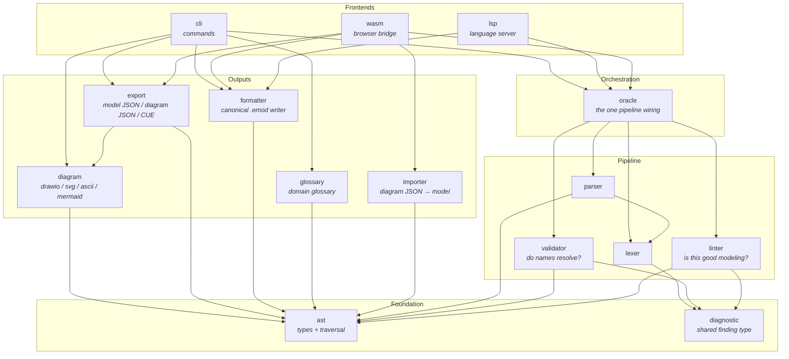
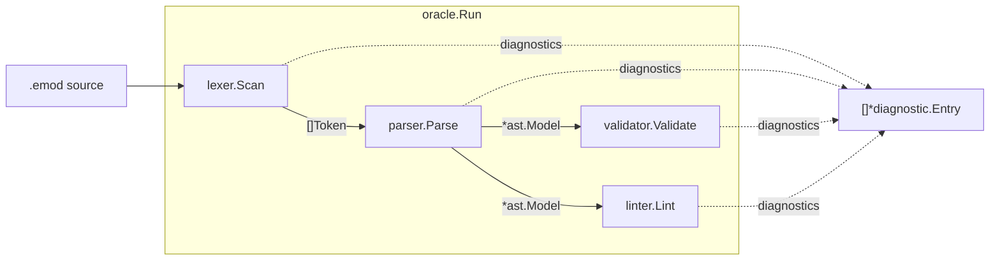
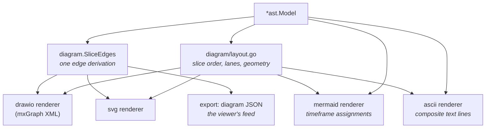
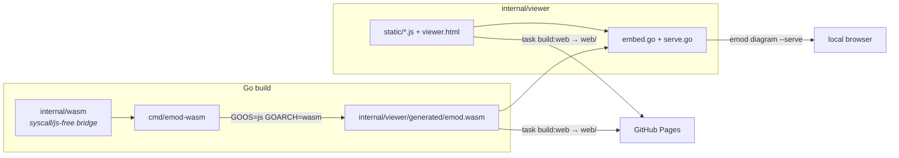
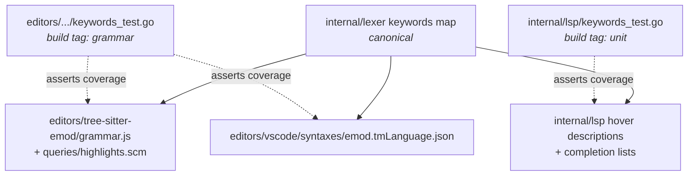

# Architecture

emod is a DSL for event modeling. You write `.emod` files describing commands,
events, views, automations and translations; the tool validates them against
event-modeling anti-patterns and renders them as diagrams. One Go module holds
the language pipeline, every frontend that drives it, and the assets of a
browser viewer; the editor grammars live beside it under `editors/`.

## Repository map

| Path | What it is |
|---|---|
| `cmd/emod` | CLI entry point (thin; all logic in `internal/cli`) |
| `cmd/emod-wasm` | WebAssembly entry point exposing the pipeline to the browser viewer |
| `internal/` | The language pipeline, frontends and renderers (see below) |
| `editors/tree-sitter-emod` | tree-sitter grammar + corpus/highlight tests |
| `editors/vscode` | VS Code extension: TextMate grammar, language config, LSP client |
| `examples/` | Showcase models (`*_test.emod` files are deliberately broken fixtures) |
| `e2e/` | Docker-based CLI end-to-end tests (vitest + node-pty) |
| `e2e-viewer/` | Playwright end-to-end tests against the built viewer bundle |
| `docs/` | Reference and architecture documentation |
| `web/`, `bin/`, `dist/` | Build outputs, gitignored — never edit these |

## Package layout

Packages form a strict layering: pure data at the bottom, pipeline stages above
it, then renderers and serializers, then the frontends that wire a pipeline run
to an interface. Arrows read "depends on".

Not shown: `internal/viewer` (the browser viewer's JS modules plus a small
embed/serve wrapper, depending on nothing above), `internal/cue` (an embedded
CUE schema the `emod schema` command prints and the export tests vet against)
and `internal/test` (shared model fixtures used only by tests).

## The language pipeline

Every frontend runs the same chain through `internal/oracle` — it is the only
place the stages are wired together, so the CLI, the LSP and the browser
cannot disagree about what a file means.

- **`oracle.Parse`** runs the lex/parse prefix and returns a best-effort model:
  non-nil even when diagnostics are present, holding whatever the parser could
  recover. Formatting and read-only commands use it.
- **`oracle.Run`** runs the full chain. `emod validate` and `emod lint` both
  use it and report identical diagnostics; commands producing output
  (`diagram`, `export`) run it first and gate on error severity.
- **`validator` vs `linter`**: the validator answers *"do referenced names
  resolve?"* and only ever emits errors; the linter answers *"is this good
  event modeling?"* (naming smells, coupling smells, DCB mode rules) at info,
  warning or error severity, each finding carrying a rule name that
  `emod lint explain <rule>` describes.
- **`ast`** is the shared vocabulary: pure node types plus the traversal
  helpers `Model.SliceRefs`/`AllSlices` and `Context.SliceRefs`/`AllSlices`,
  which return slices in source order paired with the context and aggregate
  declaring them. A slice hangs off an aggregate *or* directly off a
  `mode dcb` context — always traverse through these helpers rather than
  walking `ctx.Slices` and `agg.Slices` by hand.
- **`diagnostic.Entry`** is the one finding shape every stage emits, so
  frontends render CLI text, LSP diagnostics and viewer JSON from the same
  values.

## Diagram rendering and export

Which *arrows* a model contains is decided once, in `diagram.SliceEdges`: the
semantic edges of a slice (trigger→command, flows, subscriptions, automation
and translation wiring), including the rule that a translation's implied
command→event arrow is derived only when no flow already declares the same
pair. Renderers keep only their format's drawing concerns.

ASCII and mermaid read the AST directly by design: they don't draw arrow sets
(ASCII prints composite per-slice lines, mermaid assigns elements to
timeframes), so the edge IR has nothing to offer them. The cross-format
contract test in `internal/diagram/contract_test.go` asserts the behaviour all
renderers share.

`internal/export` holds three serializers in three files: `json.go` (a 1:1
model mirror for tooling), `diagram.go` (the `{model_name, nodes, edges}`
graph the web viewer consumes) and `cue.go` (schema-conformant CUE text).
`internal/importer` is the inverse of the diagram JSON — the viewer's edits
come back through it and are written out by `formatter`, so `.emod` text has
exactly one writer.

## Frontends

| Command | Does |
|---|---|
| `emod validate` / `emod lint` | Full pipeline; identical diagnostics, text or JSON output |
| `emod lint explain <rule>` | Describes any rule name the tool can print |
| `emod fmt` | Parse + `formatter.Format`; `--check` for CI |
| `emod diagram` | drawio / svg / ascii / mermaid; `--serve` starts the embedded viewer |
| `emod export` | json / diagram-json / cue |
| `emod slices list` | Lists every slice with its detected pattern |
| `emod glossary` | Domain glossary as markdown or JSON |
| `emod schema` | Prints the embedded CUE schema |
| `emod lsp` | Starts the language server on stdio |

The **LSP** (`internal/lsp`) layers transport framing → dispatch
(`server.go`) → one pure function per feature (`GetCompletions`,
`GetDefinition`, `GetReferences`, `GetHover`, `GetSemanticTokens`) taking
`(text, line, character)`. Diagnostics and formatting go through the oracle.
`keywords_test.go` pins that every lexer keyword has a hover description and
that completion lists never offer a spelling the lexer doesn't define.

## The browser viewer

The viewer is a plain-ES-module app living under `internal/viewer/static/`
(that location is what `//go:embed` can reach). The same pipeline runs in the
browser via WebAssembly. `docs/wasm-architecture.md` covers this subsystem in
detail.

`internal/wasm` keeps the browser-facing functions free of `syscall/js` so
they are testable; `cmd/emod-wasm` is only `js.Value` marshalling. Note the
build coupling: `internal/viewer` embeds `generated/*`, which is gitignored —
run `task build` (not bare `go build`), which depends on `build:wasm`.

## Editor tooling and the drift guards

The language is spelled in three grammar surfaces, with the Go lexer as the
single source of truth:

Adding a keyword to the lexer without updating the editor grammars fails
`task test:grammar`; without a hover description it fails the unit suite. A
standing constraint recorded in `tasks/learnings.md`: every keyword must stay
usable as a field name, on both the Go and the grammar side.

## Tests and build orchestration

Go tests are tagged: `unit` (fast, most of the suite), `integration`
(cross-stage runs over the docs and example fixtures) and `grammar` (drives
the tree-sitter CLI from Go, run via `task test:grammar`). Shared parsed-model
fixtures live in `internal/test` and go through the real lexer and parser so
their positions match production models.

`Taskfile.yml` is the build entry point — `task build` (CLI, including the
wasm embed), `task build:web` (assemble the Pages bundle), `task test`
(unit + integration + viewer + grammar + vscode; the two e2e suites run in CI).
Tool versions come from `mise.toml`; in particular tree-sitter-cli is pinned
there — use the mise-provided binary, not npx, or the generated parser will
produce phantom diffs.
