# Wasm Architecture & `diagram --serve`

```mermaid
flowchart TB
    subgraph Build["Build Step (Taskfile.yml)"]
        A["cmd/emod-wasm/main.go<br/><i>registers parseEmod &amp; exportJSON</i>"]
        B["go build -o emod.wasm<br/>GOOS=js GOARCH=wasm"]
        C["cp $(go env GOROOT)/lib/wasm/wasm_exec.js"]
        D["internal/frontend/generated/<br/>emod.wasm + wasm_exec.js"]
        A --> B --> D
        C --> D
    end

    subgraph CLI["CLI: emod diagram --serve"]
        E["internal/cli/diagram.go<br/>RunDiagramServe(path, true)"]
        F{"path provided?"}
        G["Native Go pipeline<br/>lex → parse → validate → lint → export"]
        H["Inject result as<br/>window.INITIAL_DATA"]
        I["internal/viewer/serve.go<br/>ServeViewer(port, diagramJSON)"]
        J["HTTP Server<br/>127.0.0.1:<port>"]

        E --> F
        F -- yes --> G --> H --> I
        F -- no --> I
        I --> J
    end

    subgraph Server["HTTP Server Routes"]
        K["GET /<br/>viewer.html<br/><i>+ INITIAL_DATA if provided</i>"]
        L["GET /static/*<br/>viewer.js, model.js, platform.js, ..."]
        M["GET /generated/*<br/>emod.wasm, wasm_exec.js"]
    end

    J --> Server

    subgraph Browser["Browser (Viewer)"]
        O["model.js<br/>sendParse(source)"]
        P["platform.browser.js<br/>parseEmod(source)<br/>→ worker.postMessage"]
        subgraph Worker["wasm-worker.js (Web Worker)"]
            N["import wasm_exec.js<br/>fetch → instantiateStreaming<br/>→ go.run(inst)"]
            Q["globalThis.parseEmod(jsonStr)"]
            R["emod.wasm (Go runtime)<br/>lex → parse → validate<br/>→ lint → export"]
        end
        S["Render SVG Diagram"]
    end

    M --> N
    N --> Q
    O --> P --> Q --> R
    R -- "answer by postMessage" --> S

    subgraph Files["Embedded in binary (//go:embed)"]
        T["internal/frontend/embed.go<br/>//go:embed static/* generated/*"]
    end

    D --> T
    T -.-> Server
```

## Flow Summary

1. **Build**: `cmd/emod-wasm/main.go` is cross-compiled to Wasm, producing `emod.wasm` + `wasm_exec.js` into `internal/frontend/generated/`

2. **Serve**: `emod diagram --serve` starts an HTTP server. If a file path is given, the CLI pre-parses it with the native Go pipeline and injects the diagram as `window.INITIAL_DATA` for an instant first render.

3. **Browser**: `platform.browser.js` starts `wasm-worker.js` as a Web Worker. The worker loads `wasm_exec.js` (Go runtime), then fetches and instantiates `emod.wasm`. Once typing in the source panel pauses — or at once when Render is clicked — `model.js` calls `parseEmod()` through `platform.js` with the panel's text and the open file's name → the Go pipeline runs in the worker → the diagnostics panel lists what `emod validate` reports for the same text, and source that parses redraws as SVG in place while source that does not leaves the last diagram on screen, marked out of date.

   The pipeline runs in a worker, not on the page's main thread. At a 4× CPU slowdown in Chrome, a parse of `examples/all_patterns.emod` takes 30–50 ms. On the main thread, the parse and the redraw together go above the 50 ms limit for a long task, and a key that the user types during a parse waits for the parse to end. With the worker, the main thread does only the redraw.

4. **Embedding**: Both `static/` (JS/CSS/HTML) and `generated/` (Wasm binary + runtime) are embedded into the Go binary via `//go:embed`, making the CLI fully self-contained.

## What this subsystem is not

WebAssembly is how the *browser* reaches the pipeline, not how the frontend
reaches it in general. The desktop app (`cmd/emod-desktop`) loads the same
`internal/frontend/static` modules but calls `internal/pipeline` natively
through Wails bindings: it ships no `emod.wasm`, starts no worker, loads no
`wasm_exec.js`, and starts no HTTP server. Which of the two a distribution gets
is decided when it is assembled, by which implementation of `platform.js` is
copied into place — see the platform seam in [architecture.md](./architecture.md).
