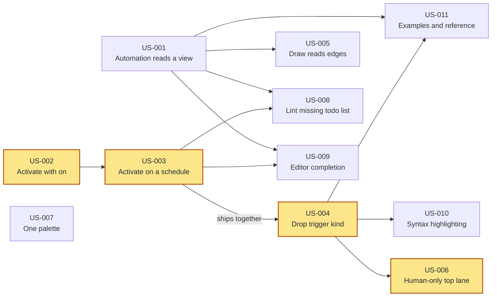

# Triggers and Automations

## Overview

Event Modeling's Automation pattern wires a processor to a view — the "todo list" of outstanding work — and then to a command. `emod` has two elements in this space and they are swapped relative to that pattern: `automation` activates on an event and cannot name a view at all, while `trigger Processor` can name a view but sits in the lane reserved for human-facing screens. The result is that the element named after the pattern cannot express the pattern, schedule-driven work has to masquerade as a user interaction, and `trigger` means two unrelated things depending on where it appears.

This realigns the two: `trigger` becomes the human entry point and nothing else, `automation` becomes the processor and gains both a schedule and the view it reads. The diagrams follow, so the top lane holds only screens and one colour names one element type in every export.

## Goals

- An automation can declare the view it reads, making the pending work it acts on visible in the model
- Schedule-driven work is modelled as an automation, with the cadence stated rather than implied
- `trigger` has exactly one meaning in the grammar, and one form: a named human entry point
- The view a trigger or automation reads is drawn as an edge, not just recorded in the file
- The top lane of every diagram holds only human-facing entry points
- One colour names one element type across SVG, draw.io, and the viewer

## Delivery Order

The shaded chain — introduce `on`, add `every`, then drop the trigger kind slot, then fix the lanes — is the critical path at four deep, and nothing else exceeds two. US-003 and US-004 must ship as one increment: removing `trigger Schedule` before `every` exists would take away the only way to express a scheduled processor.

US-001 is the other story to start early. It is independent of the whole rename chain and three stories hang off it, including the lint rule that decides whether the canonical shape becomes the default or stays merely available. US-007 depends on nothing and can be picked up at any point.

## User Stories

### US-001: Declare the view an automation reads
**Description:** As a model author, I want an automation to name the view it reads so that the pending work it acts on is visible in the model instead of implied.

**Acceptance Criteria:**
- [ ] An `automation` accepts an optional `reads <ViewName>` entry
- [ ] The name must resolve to a view declared anywhere in the model; an unresolved name is a validation error naming the view and its location
- [ ] `emod fmt` emits `reads` at a fixed position within the automation block, so repeated formatting is stable
- [ ] `emod export -f json` and `-f cue` carry the value
- [ ] A model exported, edited in the viewer, and re-imported keeps its `reads` value
- [ ] An automation without `reads` validates, formats, and exports exactly as before

**Context:** The Automation pattern wires a processor to a view, not directly to an event. That view is the backlog of outstanding work, and making it explicit is what gives retries, idempotency, and "how much is pending" somewhere to live in the model rather than only in an implementation. Without this entry an automation can only express the direct event-to-command shortcut the pattern exists to avoid.

### US-002: Name an automation's activation event with `on`
**Description:** As a model author, I want an automation's activation event introduced by `on` so that `trigger` means one thing in the DSL instead of two.

**Acceptance Criteria:**
- [ ] An `automation` accepts `on <EventName>`, carrying the same meaning and name resolution the previous spelling had
- [ ] `trigger <EventName>` inside an automation is no longer accepted, and the error names `on` as its replacement
- [ ] `emod fmt` emits `on`
- [ ] JSON and CUE exports name the field consistently with the keyword
- [ ] A model exported, edited in the viewer, and re-imported keeps its activation event
- [ ] `trigger` at slice level keeps its current meaning and behaviour

**Context:** `trigger` currently introduces a wireframe at slice level and an activation event inside an automation — one word for two unrelated things, told apart only by where it sits. Readers disambiguate by context and so does the parser.

### US-003: Activate an automation on a schedule
**Description:** As a model author, I want an automation to activate on a schedule so that nightly and periodic work is modelled as the processor it is, with its cadence stated.

**Acceptance Criteria:**
- [ ] An `automation` accepts `every "<expr>"`, where `<expr>` is either a duration (`"5m"`, `"1h"`) or a five-field cron expression (`"0 2 * * *"`)
- [ ] An expression matching neither form is a validation error that names both accepted forms
- [ ] An automation declaring both `on` and `every` is a validation error
- [ ] An automation declaring neither is a validation error naming both as options
- [ ] `emod fmt` emits `every` at a fixed position, and JSON and CUE exports carry it
- [ ] A scheduled automation renders with a clock badge carrying its expression

**Context:** Time-driven work has no home on an automation, which is why it currently gets spelled as a trigger. Requiring exactly one activation form makes a processor's wake-up explicit — whether it is woken by the event that adds to its backlog or polls on a clock. Both are real designs with different failure modes, and authors otherwise leave the choice unstated.

**Depends on:** US-002

### US-004: Drop the trigger kind slot
**Description:** As a model author, I want `trigger` to take just a name so that the top-lane element stops claiming to describe machine-driven activation.

**Acceptance Criteria:**
- [ ] `trigger "<name>" { ... }` parses, with the quoted name following the keyword directly
- [ ] `trigger UI "<name>"`, `trigger Schedule "<name>"`, and `trigger Processor "<name>"` are no longer accepted
- [ ] The error for a removed spelling names its replacement: drop the word for `UI`, use an automation with `every` for the other two
- [ ] `emod fmt` emits the kindless form, and JSON and CUE exports no longer carry a kind
- [ ] A model exported, edited in the viewer, and re-imported keeps the trigger's name, actor, and reads entries
- [ ] Every example and fixture in the repository uses the new form and passes `emod validate`

**Context:** The kind is currently free-form text that nothing validates, so any word parses. Once schedules and processors move to `automation`, every trigger is a human entry point and the slot would have exactly one legal value — a mandatory token carrying no information.

**Depends on:** US-003

### US-005: Draw the view a trigger or automation reads
**Description:** As a model author, I want the view a trigger or automation reads drawn as an edge so that the diagram shows a wire the model already declares.

**Acceptance Criteria:**
- [ ] A trigger with `reads` renders an edge from the named view to the trigger, in SVG, draw.io, and the viewer
- [ ] An automation with `reads` renders an edge from the named view to the automation, in the same three outputs
- [ ] Both edges carry the visual treatment the translation `reads` edge already uses
- [ ] An edge drawn in the viewer from a view to a trigger or automation is re-imported as a `reads` entry on that element
- [ ] A trigger or automation without `reads` renders exactly as before

**Context:** `reads` on a trigger has been parsed, formatted, and exported since triggers existed, but no exporter has ever drawn it — the wire is in the file and on no diagram. Only translations currently get a `reads` edge.

**Depends on:** US-001

### US-006: Read the top lane as human-only
**Description:** As a model author, I want the top lane to hold only human entry points so that the diagram teaches the same pattern the model expresses.

**Acceptance Criteria:**
- [ ] In SVG and draw.io, automations and translation reactors render in the command and view lane rather than the top lane
- [ ] In the viewer, automations and translations render below the trigger row rather than above it
- [ ] The top lane is labelled "Wireframes" in SVG and draw.io
- [ ] Automations emit the processor timeframe in Mermaid output, and triggers emit the UI timeframe
- [ ] Every automation and translation reactor keeps its gear marking, so it stays distinguishable from commands and views in its new position
- [ ] An automation's edges to the view it reads and the command it issues remain drawn and legible after the move

**Context:** The three outputs place these elements differently and all three are wrong in the same direction. SVG and draw.io draw automations inside the lane labelled for user interfaces; the viewer stacks them in a row *above* the trigger, so the machine sits higher than the human it serves. Processors belong beside the view they read and the command they issue, both of which already sit in the middle lane — a fourth lane for machines would repeat the mistake of elevating an implementation actor to the same status as the three element types Event Modeling defines.

**Depends on:** US-004

### US-007: One palette for element types
**Description:** As a model author, I want each element type to have one colour everywhere so that a colour means the same thing whichever command produced the diagram.

**Acceptance Criteria:**
- [ ] Each of trigger, command, event, view, automation, and translation has one fill and stroke shared by SVG, draw.io, and the viewer
- [ ] No two element types share a fill
- [ ] A trigger is distinguishable from the other element types by shape or framing, not by colour alone — it reads as a screen rather than as another sticky note
- [ ] The palette documented in the DSL reference matches what the exporters emit

**Context:** One fill colour currently names automations in SVG and draw.io and triggers in the viewer, so the same swatch identifies a different element depending on which command was run. Command, event, and view already follow Event Modeling's three sticky colours; the disagreement is confined to the elements this feature realigns.

### US-008: Flag automations with no todo list
**Description:** As a model author, I want a lint warning when an automation declares no view so that direct event-to-command coupling is visible rather than silent.

**Acceptance Criteria:**
- [ ] `automation/missing-todo-list` (warning) fires for an automation with no `reads`
- [ ] For an event-activated automation, the message says nothing in the model shows what work is outstanding, and suggests projecting a view of pending work
- [ ] For a schedule-activated automation, the message says the model does not state what the processor acts on
- [ ] The rule honours the existing severity configuration and `emod lint --explain <rule>`
- [ ] An automation with `reads` produces no diagnostic

**Context:** `reads` stays optional so an automation can be sketched before its view exists, which is how models actually get drafted. But without a rule naming the cost, the shorter direct-coupling form remains the least effort to write and nothing points at what it gives up. This rule is what makes the canonical shape the default rather than merely available.

**Depends on:** US-001, US-003

### US-009: Complete and navigate automations in the editor
**Description:** As a model author using an LSP-capable editor, I want hover, completion, and navigation for the new entries so that I can author automations without consulting the reference.

**Acceptance Criteria:**
- [ ] Completion inside an automation block offers `on`, `every`, `reads`, `command`, and `target context`
- [ ] Completion after `on` offers event names; after `reads`, view names
- [ ] Hovering `on`, `every`, or `reads` describes what each does
- [ ] Hovering `trigger` or `automation` states which Event Modeling pattern the element belongs to
- [ ] Go-to-definition works from an automation's `on` event, its `reads` view, and its `command`
- [ ] Find-references on a view lists the automations and triggers that read it

**Context:** The current hover text describes `automation` as triggering on an event and sending a command, which stops being accurate once schedules and views arrive.

**Depends on:** US-001, US-003

### US-010: Highlight the realigned syntax
**Description:** As a model author, I want the new keywords highlighted so that an automation's activation reads as structure rather than prose.

**Acceptance Criteria:**
- [ ] `on` and `every` highlight as keywords in the VS Code extension and the tree-sitter grammar
- [ ] A trigger's quoted name highlights as a name, now that no kind identifier precedes it
- [ ] `on` and `every` in field-name position highlight as field names, not keywords
- [ ] Folding, indentation, and text-object selection work on trigger and automation blocks in their new shapes

**Depends on:** US-004

### US-011: Learn the realignment from examples and the reference
**Description:** As a model author new to these patterns, I want the examples and reference to show the realigned forms so that I learn them from working models instead of the grammar.

**Acceptance Criteria:**
- [ ] `examples/all_patterns.emod` uses the kindless trigger and an automation that reads a view, and passes `emod validate`
- [ ] A schedule-activated automation appears in the examples, together with the view it reads
- [ ] `docs/dsl-reference.md` documents `on`, `every`, and `reads` on automations, and the trigger without a kind
- [ ] The reference states that a trigger is the human entry point and an automation is the processor, naming the chain each belongs to
- [ ] The README quick-start uses the new forms
- [ ] No document or example in the repository shows a removed spelling

**Depends on:** US-001, US-004

## Non-Goals (Out of Scope)

- **Wireframe assets.** Pointing a trigger at a mockup image and rendering it in place of the box. Mermaid cannot embed images at all, so the attribute would render unevenly by construction; deferred until the box-versus-screen distinction from US-007 proves insufficient on its own.
- **Relative delays on activation.** Firing an automation a fixed duration after an event lands with the specs and metadata work, not here.
- **Runtime scheduling semantics.** Durability, delivery guarantees, idempotency, and clock skew are implementation properties. The model states the cadence and stops.
- **Inferring a todo-list view.** An automation without `reads` is warned about, never silently given a view.
- **Changing the Translation pattern's wiring.** Only its lane placement moves.
- **A DSL version bump.** `emod` is pre-release, so the version header stays at 1 and retired spellings fail as parse errors rather than versioning messages.
- **A dedicated lane for processors.** Automations move into the existing command and view lane.
- **Renaming `trigger` to `wireframe`.** The element covers non-graphical human entry points — an IVR menu, a CSV drop, a call taken by a support agent — so it keeps the role name.

## Open Questions

- `every` accepts both durations and cron expressions in one attribute, which puts two grammars behind one field. The alternatives are two attributes or cron only. Assumed one field, since authors think of both as "how often" — but the validation message has to name which grammar failed.
- Should `automation/missing-todo-list` be promoted from warning to error once models have adopted `reads`? Assumed not for now; the warning is meant to be adoptable, and promotion is a later call once it is clear whether warnings get ignored.
- Requiring exactly one of `on` and `every` asks for a decision that Event Modeling boards often leave implicit — a gear that means "somehow, continuously". If it proves onerous, a third mode meaning "polls, cadence unspecified" can be added without breaking anything. Assumed the requirement is worth the friction, since a processor whose wake-up is unstated is what pushed schedules into `trigger`.
- US-006 gives the viewer a different fix from SVG and draw.io because the viewer has no Event Modeling lanes at all — its swimlanes are per context, and element ordering is a stack within each slice. Assumed moving automations below the trigger row is the right equivalent; if the viewer should instead grow real lanes, that is a larger change than this story.
